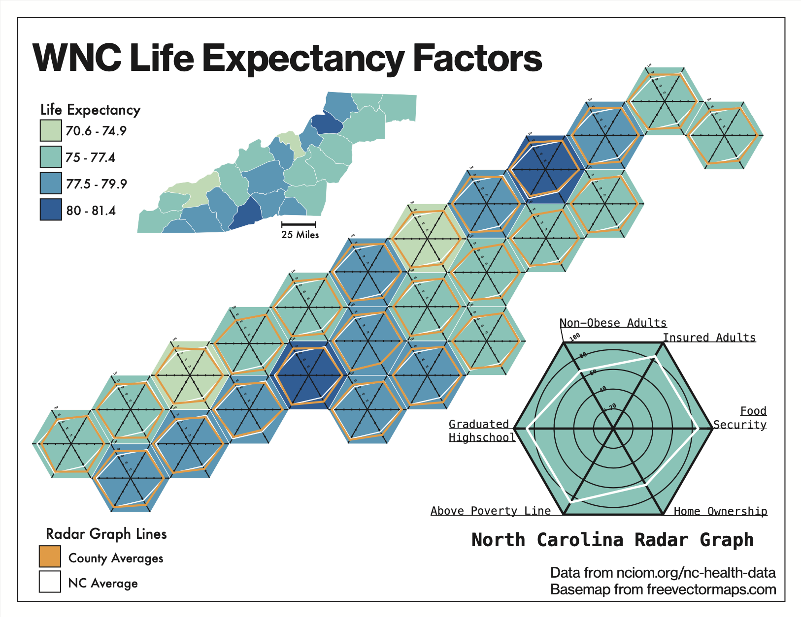
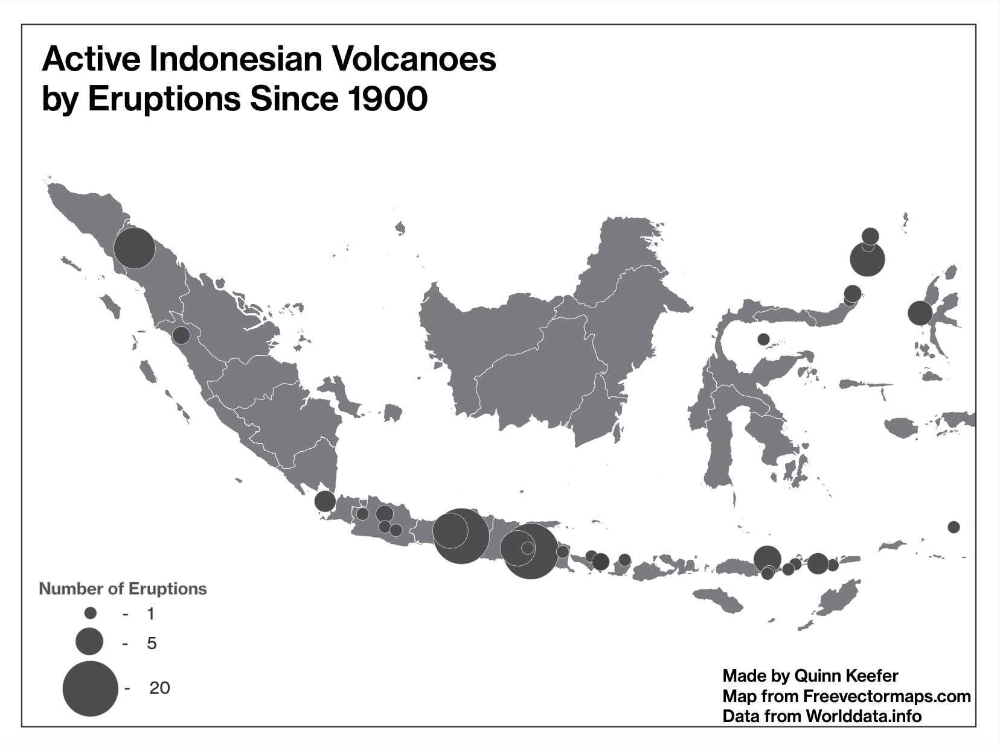
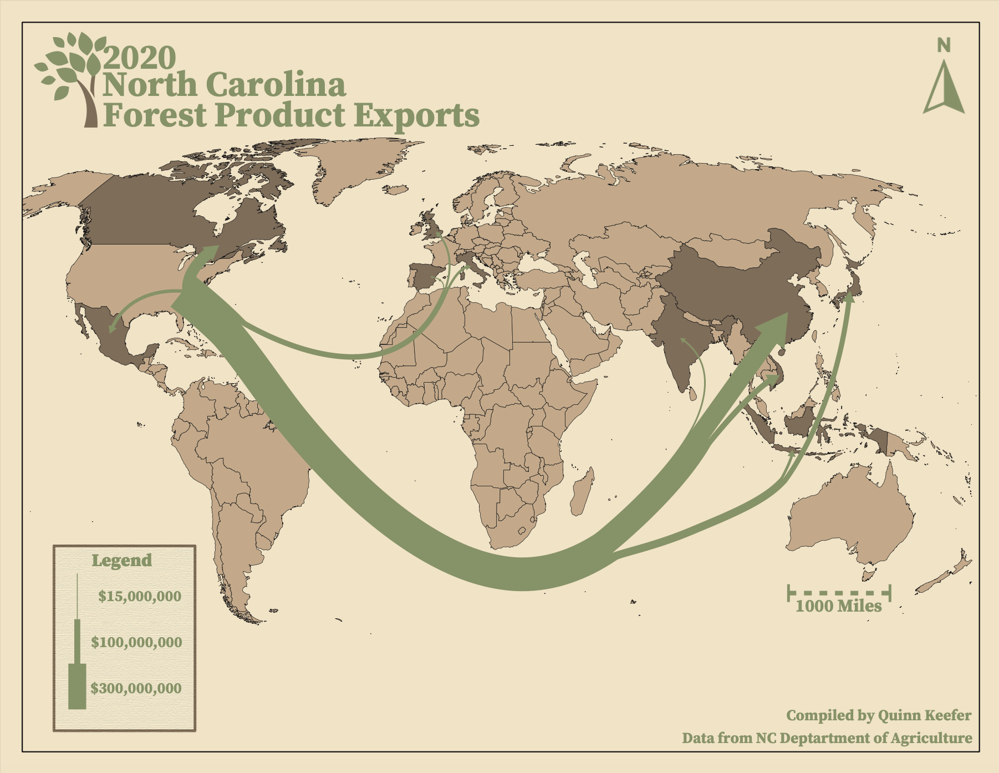

# Quinn Keefer
Undergraduate Research Assistant
Appalachian State University
Boone, NC

## Summary
I am currently persuing a undergraduate degree in Geography at Appalachian State University with a concentration in [GIS](https://en.wikipedia.org/wiki/Geographic_information_system). Currently I am working on several research projects with professors with hopes of publishing academic articles. My main research interests are in remote sensing, and spatial statistics.
## Portfolio

<iframe src="https://appalachian.maps.arcgis.com/apps/instant/basic/index.html?appid=3b5775b3603a4d2abb3ec15eac5dfe45" width="660" height="495" frameborder="0" style="border:0" allowfullscreen>iFrames are not supported on this page.</iframe>

## Education
######    **Appalachian State University**
Fall 2023 - Present

## Professional Experience 
###### **Undergraduate Research Assistant - Appalachian State University - Boone, NC**
- Spring 2024 - Present
###### **Front of House - Hole Doughnuts - Asheville, NC**
- Spring 2021 - Winter 2023

